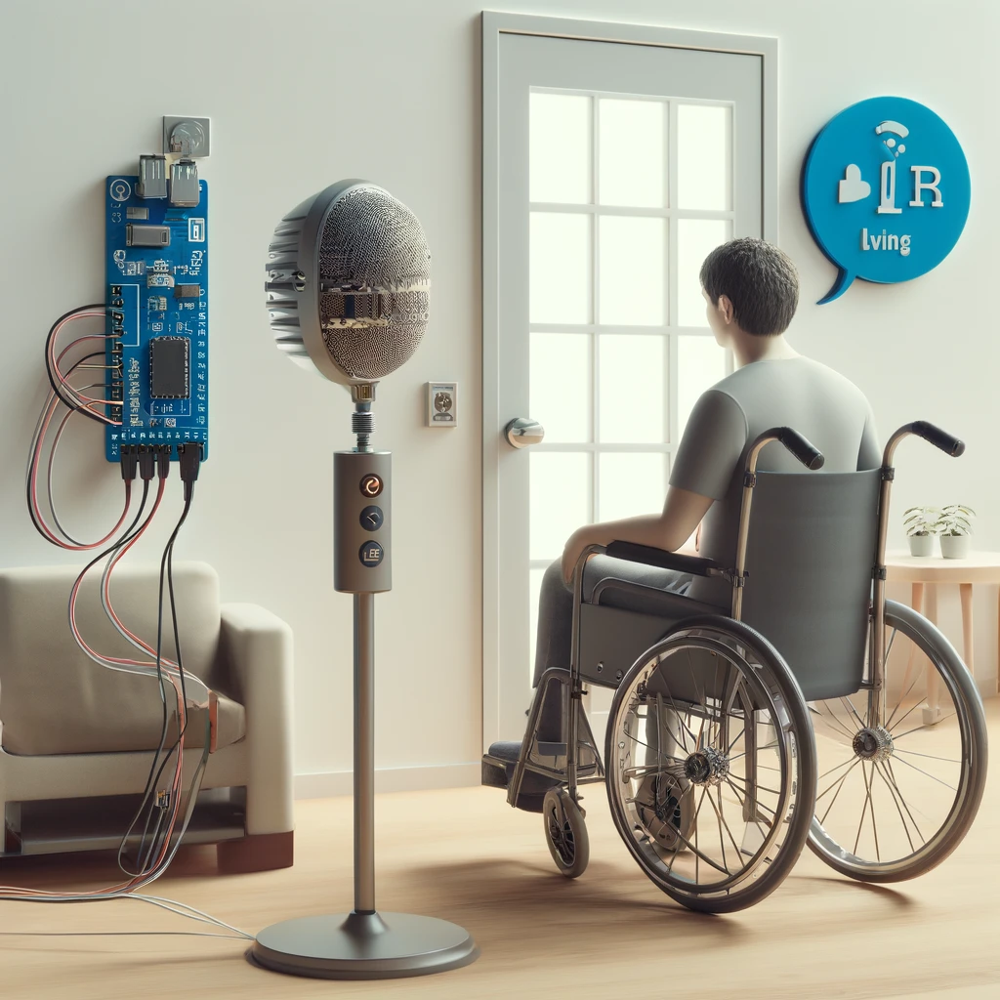

# V-Map Voice Command System

The V-Map is a voice command system developed to help quadriplegic individuals interact with their environment through simple voice commands. This system translates spoken commands into radio frequency (RF) signals to control various devices wirelessly, such as automatic door openers.

    

## System Components

- **Voice Recognition Module:** Utilizes EasyVR for reliable voice command recognition.
- **Processing Module:** Employs Arduino Duemilanove to decode voice inputs and manage signal processing.
- **Transmitter Module:**
  - **Encoder:** HT12E encoder for signal encoding.
  - **Transmitter:** TWS-BS handles the wireless transmission of the encoded signal.
- **Receiver Module:**
  - **Receiver:** RWS-371 receives the transmitted signal.
  - **Decoder:** HT12D decodes the received signal.
  - **Solid-State Relay:** JWD-107-5, controlled by the decoded signals to activate the door switch.
 
For detailed component specifications, please refer to the corresponding datasheets in the `component datasheets` folder.   

## Features

- **Wireless Communication:** Enables remote control of devices without physical wiring.
- **Designed for Accessibility:** Provides ease of use for individuals with mobility challenges.
- **Modular Setup:** Allows for customization to suit different applications and needs.
- **Low Power Consumption:** Optimized for minimal energy use while maintaining efficient functionality.

## Setup and Installation

1. Assemble the modules following the instructions in the `schematics` folder.
2. Upload the provided code to the Arduino board from the `source_code` folder.
3. Train the EasyVR module with the necessary commands as detailed in **section 3.1 - Training a command** of the `Architectural Design.pdf` document.

## Usage

Operate the V-Map by speaking predefined commands to activate the connected devices. For example, saying "Open door" triggers the door opener mechanism. More examples and detailed command usage can be found in **section 3.2 - Trained commands and corresponding bits** of the `Architectural Design.pdf` document.

Watch the [Prototype Demonstration Video](https://drive.google.com/file/d/1lbnJuV_TK72wu2umAgaJuwPUvwt3Io0S/view?usp=sharing) to see the V-Map in action.

## Acknowledgements

This project was part of the [BMET 4402 Biomedical Engineering Technology Project](https://www.bcit.ca/outlines/20201011965/) course and was completed as a 2020 graduation project. Special thanks to BMET instructors for guidance, our client for inspiration, and BMET class of 2020 for support.